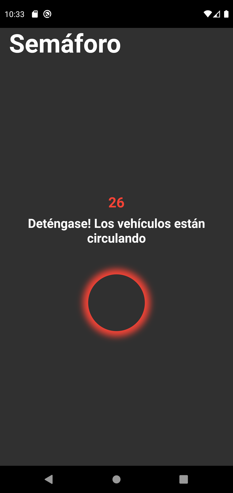
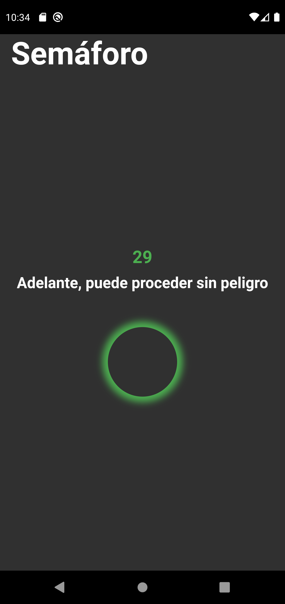
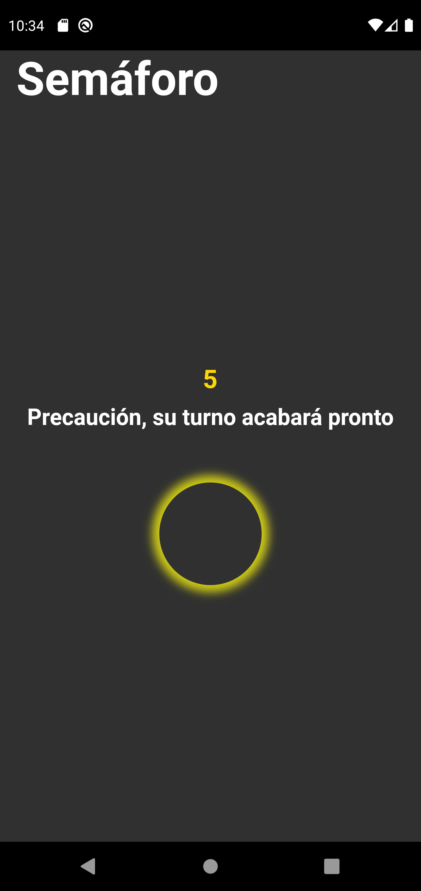

# Traffic Lights App

Mobile Application to help blind and or deaf people to cross the streets without danger

Each 30 seconds the traffic light state changes into a new one established by the API provided value
When the traffic light state is green and 5 seconds are left the traffic light turns to yellow.

Each time the traffic light state changes it vibrates and produces a text to speech based on the displayed message.

## Screenshots
### Traffic Light in red

### Traffic Light in green 

### Traffic Light in yellow
